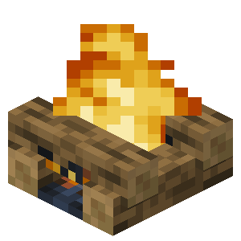

---

 

<pre>
Меня зовут Иван <b>(Shekko)</b>, i'm <del>groot</del> web-dev.
Я люблю минимализм, так что вкратце обо мне:

💻 | WEB-разработка на <b>React</b> и <b>TS</b>
⚙️ | Есть свой игровой сервер <b>Minecraft</b>
🧮 | Люблю решать <b>code-задачки</b>
🤖 | Не стесняюсь обращаться к <b>LLM</b>

</pre>

 
 

 	       

